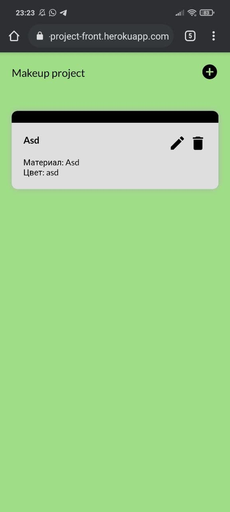

# make
GET ALL
https://makeup-back.herokuapp.com/api/main

GET BY ID
https://makeup-back.herokuapp.com/api/main/{id}

POST
https://makeup-back.herokuapp.com/api/main/create
in body 
{
     "name": "3d model",
    
     "material": "plastic",
    
     "color": "red"
}

PUT
https://makeup-back.herokuapp.com/api/main/update/{id}
in body
{
     "name": "3d model",
    
     "material": "metal",
    
     "color": "black"
}

DELETE
https://makeup-back.herokuapp.com/api/main/delete/{id}

 Backend:
https://makeup-back.herokuapp.com/api/main

Swagger:
https://makeup-back.herokuapp.com/swagger-ui.html

